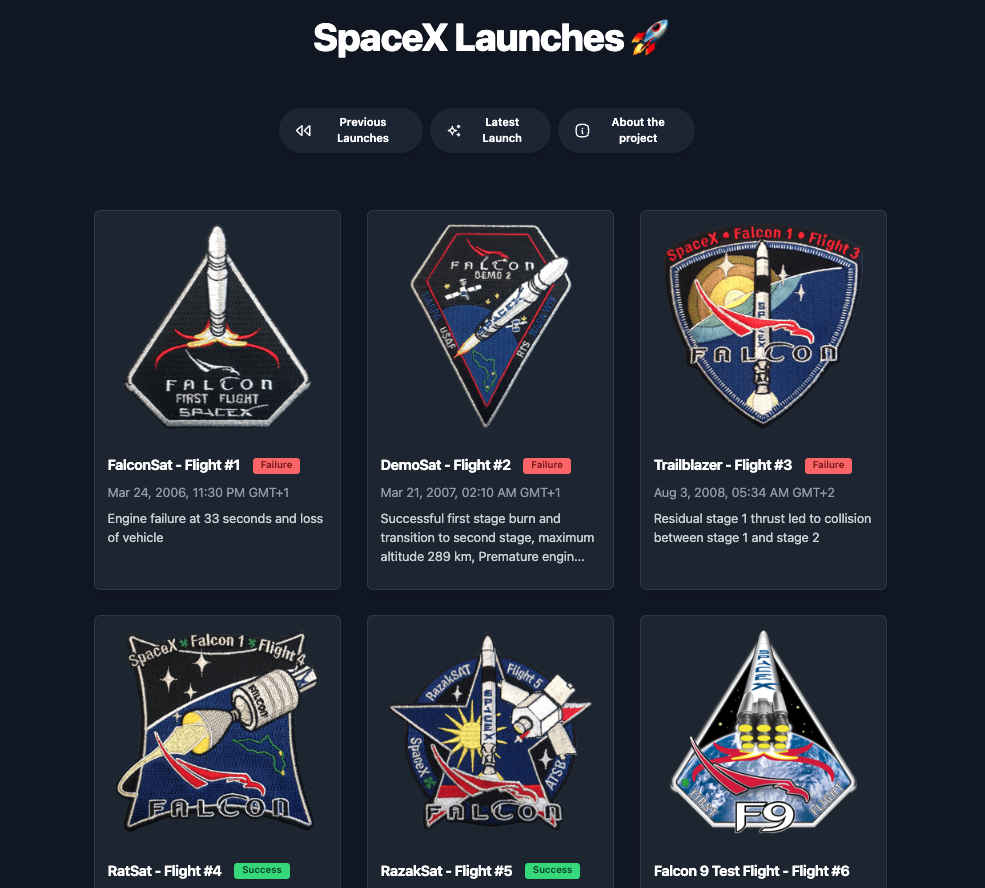
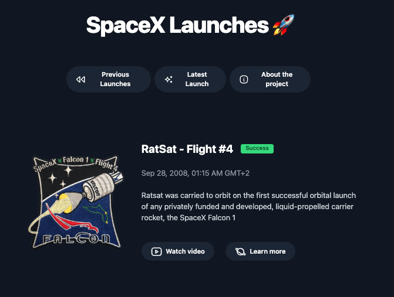

# SpaceX Launches Demo

  

---

## 🚀 Description

This project is a demo built with **Astro** that showcases SpaceX launches using real data.  
It's a great example to explore modern technologies, API consumption, and clean, responsive UI design.

---

## 🛠️ Technologies Used

- Astro (Static Site Generator)
- Tailwind CSS (Styling)
- TypeScript / JavaScript
- SpaceX Public API for live launch data

---

## 🔍 Features

- List of launches with details and images
- Links to official SpaceX videos and articles
- Responsive design optimized for both mobile and desktop

---

## 🖼️ Screenshots

<p align="center">
  
  &nbsp;&nbsp;&nbsp;
  
</p>

---

## 🚧 Installation and Local Usage

1. Clone the repository:  
   ```bash
   git clone https://github.com/florchial/space-launches-website.git

2. Install dependencies:
    ```bash
    npm install

3. Run the development server:
    ```bash
    npm run dev

4. Open your browser at http://localhost:4321

---

## Acknowledgements

This project was created based on a tutorial by [midudev](https://midu.dev), who provided an excellent step-by-step guide to building Astro projects.

---

## 📄 License
MIT License © 2025 florchial

---

## 📫 Contact
Find the source code and more info on my GitHub.